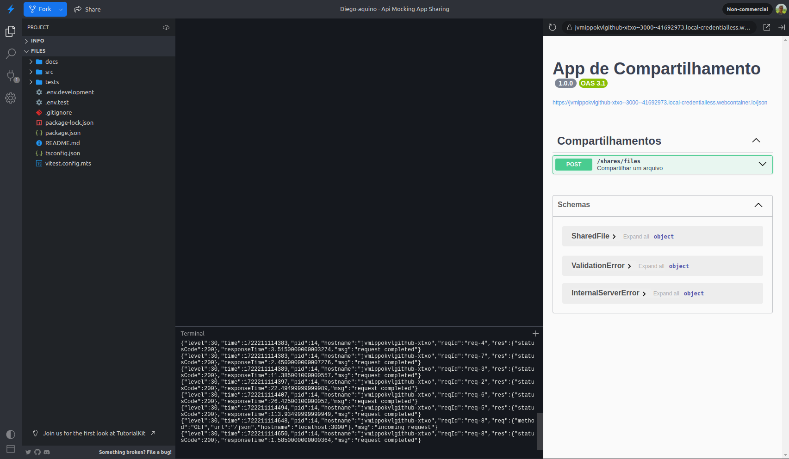
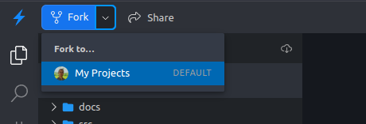
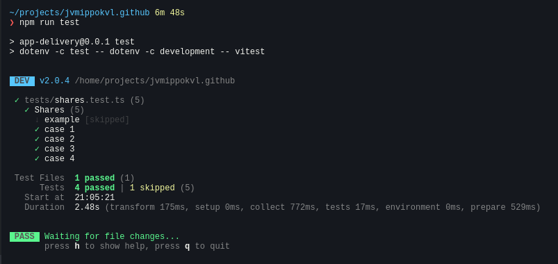
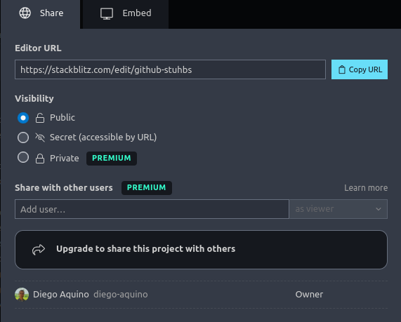
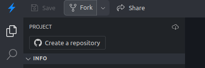

# Mocks de API - App de Compartilhamento

Esta aplicação representa uma plataforma simplificada de compartilhamento de
arquivos. Ela possui uma rota para fazer upload de um arquivo, cujo conteúdo não
precisa ser incluído por simplificação. Opcionalmente, o usuário pode solicitar
que o arquivo seja convertido para outro formato antes de compartilhar. Nesse
caso, a aplicação envia o arquivo para uma API de conversão e a aguarda através
de um mecanismo de pooling (requisições periódicas em um curto intervalo de
tempo). Após finalizar o compartilhamento, a aplicação retorna uma resposta de
sucesso ao usuário.

## 1. Acesso

Primeiramente, abra este projeto no Stackblitz utilizando o link a seguir:

https://stackblitz.com/github/diego-aquino/api-mocking-app-sharing?startScript=dev&file=README.md

Esse link abrirá um editor semelhante ao
[VS Code](https://code.visualstudio.com) no seu navegador, instalará as
dependências com `npm install` e iniciará o servidor com `npm run dev`.

No lado esquerdo, estará a estrutura de pastas do projeto, seguida de um editor
e terminal no centro e um mini-navegador no lado direito.



No canto superior esquerdo, clique em "Fork" para salvar o projeto no seu perfil
do Stackblitz. Você precisará fazer login.



## 2. Estrutura

Este projeto utiliza [Node.js](https://nodejs.org) com
[TypeScript](https://www.typescriptlang.org), [Fastify](https://fastify.dev),
[Axios](https://axios-http.com) e [Vitest](https://vitest.dev).

Arquivos importantes:

- [`src/server/app.ts`](./src/server/app.ts): arquivo principal da aplicação
  onde o servidor está implementado.
- [`src/clients/conversion.ts`](./src/clients/conversion.ts): classe que faz as
  chamadas HTTP para a API de localização.
- [`tests/shares.test.ts`](./tests/shares.test.ts): arquivo com os testes do
  compartilhamento.

Comandos úteis:

- `npm run dev`: inicia o servidor em modo de desenvolvimento.
- `npm run test`: executa os testes da aplicação.
- `npm run types:check`: verifica se não há erros de tipagem no código.

A URL da API de localização está declarada no arquivo
[`.env.development`](./.env.development). Ela está disponível em duas versões:

| Versão | URL                                       |
| ------ | ----------------------------------------- |
| v1     | https://v1-conversion-bd636ba3.vercel.app |
| v2     | https://v2-conversion-bd636ba3.vercel.app |

> [!TIP]
>
> Você pode acessar os links acima para ver a documentação de cada versão da
> API.

## 3. Atividade

### Parte 1: Criação de testes

Na primeira parte da atividade, você implementará uma suite de testes para esta
aplicação. Você deve utilizar **uma** das duas ferramentas de mocks de API
planejadas, [MSW](https://mswjs.io) ou
[Zimic](https://github.com/zimicjs/zimic), de acordo com a sua alocação para o
App de Compartilhamento [nesta planilha]().

@TODO ADICIONAR LINK DA PLANILHA

Os testes devem ser implementados em
[`tests/shares.test.ts`](./tests/shares.test.ts). Esse arquivo já possui um
exemplo de teste e stubs dos quatro casos a serem implementados:

1. Deve retornar uma resposta de sucesso quando um arquivo foi compartilhado sem
   conversão;
2. Deve retornar uma resposta de sucesso quando um arquivo foi compartilhado com
   conversão;
3. Deve retornar uma resposta de erro quando a conversão de um arquivo
   compartilhado resultou em um erro;
4. Deve retornar uma resposta de erro quando não foi possível utilizar a API de
   conversão por um erro desconhecido.

Para executar os testes, utilize o comando `npm run test`. Ao realizar mudanças
na aplicação ou nos testes, a suite será executada automaticamente.



> [!IMPORTANT]
>
> É esperado que a API de localização não seja acessada durante a execução
> testes, que utilizarão os mocks para simular as respostas da API.

Após implementar os casos descritos acima, salve o link de compartilhamento do
projeto. Você deverá enviá-lo no formulário de entrega. Confirme que o link está
com visibilidade pública.



### Parte 2: Adaptações após mudança na API de localização

Nessa segunda parte, vamos migrar o projeto para utilizar a versão 2 da API de
localização, que possui certas mudanças em relação à versão 1.

Antes de iniciar, crie uma cópia do projeto que você utilizou na parte 1. Para
isso, clique no botão "Fork" no canto superior. O objetivo é manter o projeto da
parte 1 inalterado e utilizar uma cópia dele para migrar para a versão 2 da API.



Na cópia criada, você deve alterar o arquivo
[`.env.development`](./.env.development) para utilizar a URL da versão 2 da API,
comentando a linha 4 e descomentando a linha 5.

`.env.development`:

```bash
NODE_ENV=development
PORT=3000

# CONVERSION_API_URL=https://v1-conversion-bd636ba3.vercel.app
CONVERSION_API_URL=https://v2-conversion-bd636ba3.vercel.app
```

Se o servidor ou o comando de testes estiverem rodando, você deve reiniciá-los
para que a nova URL seja lida.

Entre as versões 1 e 2 da API, as seguintes modificações foram realizadas:

- O campo `inputFile.format` ao criar uma conversão, que antes era opcional e
  inferido a partir da extensão do arquivo, agora é obrigatório;
- No retorno das cidades, os seguintes campos foram modificados:
  - `inputFileName` e `inputFileFormat` agora fazem parte de um objeto
    `inputFile`, nas propriedades `inputFile.name` e `inputFile.format`,
    respectivamente.
  - `outputFileName` e `outputFileFormat` agora fazem parte de um objeto
    `country`, nas propriedades `outputFile.name` e `outputFile.format`,
    respectivamente.

Agora, você deve adaptar a aplicação, os testes e os mocks de API para lidar com
essas mudanças.

Após realizar as adaptações, salve o link de compartilhamento do projeto usado
nesta parte 2. Você também deverá enviá-lo no formulário de entrega ao final da
atividade, juntamente com o link da parte 1.

## 4. Entrega

Após finalizar as implementações nesta aplicação e no
[App de Entregas](https://github.com/diego-aquino/api-mocking-app-delivery),
preencha o formulário de entrega com os links das partes 1 e 2.

@TODO ADICIONAR LINK DO FORMULÁRIO
